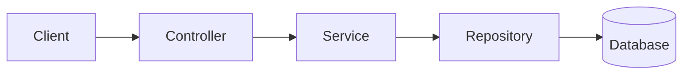

# Backend architecture and rules

## Scope

These rules apply to Sport Matcher backend services built with Kotlin and Spring Boot. The authentication service is the reference implementation. New services should follow the same boundaries, naming conventions, testing strategy, and security practices unless an architectural decision explicitly replaces a rule.

## Package structure

Organize code by business capability first and by technical responsibility second.

```text
com.navyblue.sportmatcher.<service>
├── <feature>
│   ├── controller
│   ├── dto
│   ├── service
│   ├── entity
│   └── repository
├── config
└── infrastructure
```

A feature only needs the subpackages it uses. Shared code belongs at the service root only when multiple features depend on it. Do not create a general-purpose shared package for code used by one feature.

Dependencies flow inward:



- Controllers may depend on DTOs and services.
- Services may depend on repositories, entities, configuration, and other services with a clear domain reason.
- Repositories must not depend on controllers or transport DTOs.
- Entities must not depend on controllers, services, or transport DTOs.
- Lower layers must not call higher layers.

## Layer responsibilities

### Controller

- Own HTTP paths, request deserialization, request validation, response status codes, and response DTOs.
- Keep controller methods small and delegate use cases to services.
- Do not implement business rules or access repositories directly.
- Return stable HTTP contracts. Error responses use a machine-readable code such as `INVALID_LOGIN_CREDENTIALS`.

### DTO

- Define the external API contract independently from persistence entities.
- Apply Jakarta validation annotations to request fields.
- Do not expose JPA entities from HTTP endpoints.
- Keep secrets and internal persistence details out of responses.

### Service

- Implement one business use case per public operation.
- Enforce business rules and coordinate repositories or supporting services.
- Put `@Transactional` on the service operation that owns a multi-step database change.
- Avoid HTTP-specific types and status-code decisions.

### Entity and repository

- Keep persistence mapping in entities and database access in repositories.
- Use Spring Data derived queries for simple lookups.
- Use explicit JPQL only when a derived query would be unclear or insufficient.
- Keep database constraints aligned with domain invariants, including uniqueness and nullability.
- Introduce schema changes through Liquibase migrations. Do not edit an applied migration; add a new one.

### Configuration and infrastructure

- Bind service settings through typed `@ConfigurationProperties`.
- Keep framework wiring, security configuration, and external-system adapters outside feature business logic.
- Supply secrets through runtime configuration. Never commit credentials or token-signing secrets.

## Kotlin rules

- Always use block bodies with braces (`{}`) for functions.
- Do not use expression bodies with `=` for functions.
- SQL and JPQL query strings must be multiline, never one line.
- Format `@Query` values as triple-quoted strings with one clause per line:

  ```kotlin
  @Query(
      """
      update RefreshToken refreshToken
      set refreshToken.isRevoked = true
      where refreshToken.tokenHash = :tokenHash
      """,
  )
  ```

- Raw JDBC SQL in tests must also use triple-quoted multiline strings with one clause per line:

  ```kotlin
  """
      select id from refresh_tokens
      where user_id = ?
  """
  ```

## API and security rules

- Validate every untrusted request at the HTTP boundary and repeat critical invariants in the domain or database where appropriate.
- Use one generic response for credential failures so an endpoint does not reveal whether an account exists.
- Hash passwords with an adaptive password hash such as BCrypt. Never store or log raw passwords.
- Store only hashes of opaque refresh tokens; return the raw token only to the client that requested it.
- Mask personal data in logs and never log access tokens, refresh tokens, credentials, or secrets.
- Deny access by default. Public endpoints must be explicitly allow-listed in security configuration.
- Use stable error codes in API responses and avoid exposing exception messages or stack traces.

## Testing rules

Use the smallest test scope that proves the behavior:

- A service unit test uses mocks or fakes and does not start Spring.
- A controller slice test uses `@WebMvcTest`, mocks the service, and verifies the HTTP contract.
- An integration test uses `@SpringBootTest` only when the full application or real persistence behavior is required.
- Persistence integration tests use the same database engine as production, provided through Testcontainers.

All backend tests follow these rules:

- Structure non-trivial tests with `given`, `when`, and `then` sections.
- Name integration test classes with the `IT` suffix.
- Controller test names must include the expected status as `HTTP 200`, `HTTP 400`, `HTTP 401`, and so on.
- Never clean the database in integration tests.
- Generate unique test values, such as random UUIDs and email addresses, so tests are isolated and can run in any order.
- Verify both the returned result and important side effects.
- Cover successful behavior, validation failures, business failures, and security-sensitive failures.

## Definition of done

A backend change is ready when:

- production and test code follow the dependency and Kotlin rules above;
- unit, controller, and integration tests pass at the appropriate scopes;
- lint passes;
- database changes include a migration and persistence-level coverage;
- API behavior or cross-service interactions are documented;
- logs and error responses do not expose sensitive data;
- dependency and security scans have no unresolved high-severity findings.
