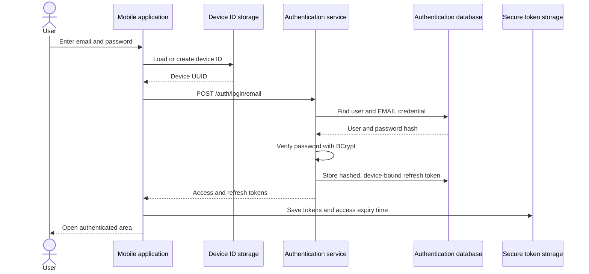

# User login

## Overview

Users sign in with an email and password to receive tokens that give the mobile application access to authenticated features.

## User flow

1. An unauthenticated user sees the welcome screen and selects **Sign in**.
2. The application displays email and password fields.
3. The sign-in button becomes active when:
   - the email has a valid format and is no longer than 254 characters;
   - the password contains between 12 and 255 characters.
4. The application loads an existing device ID or generates and persists a UUID.
5. The application calls `POST /auth/login/email`.
6. The authentication service looks up the user and their email credential, then verifies the password against the stored BCrypt hash.
7. On success, the service creates an access JWT and a refresh token.
8. The application stores the returned tokens in platform secure storage and replaces the sign-in screen with the bottom navigation screen.
9. On failure, the user stays on the sign-in screen and sees an error in a red snackbar.

The email and password are sent as entered. The current implementation does not trim whitespace or normalize email casing.

## Interaction



## API contract

### Request

`POST /auth/login/email`

The endpoint is public and expects `Content-Type: application/json`.

```json
{
  "email": "user@example.com",
  "password": "Password1234",
  "deviceId": "550e8400-e29b-41d4-a716-446655440000"
}
```

| Field | Type | Required | Validation and use |
| --- | --- | --- | --- |
| `email` | string | yes | Must be non-blank and a valid email address. Used to find the user. |
| `password` | string | yes | Must be non-blank. Compared with the stored BCrypt hash. |
| `deviceId` | string | yes | Must be non-blank. Associated with the issued refresh token. |

The backend accepts any non-blank password, while the mobile form only submits passwords containing 12 to 255 characters.

### Success response

Status: `200 OK`

```json
{
  "accessToken": "<jwt>",
  "refreshToken": "<opaque-token>",
  "tokenType": "Bearer",
  "expiresIn": 900
}
```

| Field | Description |
| --- | --- |
| `accessToken` | Signed JWT used as the access credential. |
| `refreshToken` | Opaque UUID token used to obtain a new token pair. |
| `tokenType` | Always `Bearer`. |
| `expiresIn` | Access-token lifetime in seconds; the default is 900 seconds. |

The JWT subject is the user ID. It also contains the email, a unique token ID, issue time, and expiration time. The refresh-token lifetime defaults to 604800 seconds (7 days).

### Invalid credentials response

Status: `401 Unauthorized`

```json
{
  "code": "INVALID_LOGIN_CREDENTIALS"
}
```

The same response is returned when the user does not exist, the email credential or password hash is missing, or the password does not match. The mobile application displays `Invalid login or password.` for this code.

### Other errors

Request validation failures return `400 Bad Request`. Other HTTP, timeout, connectivity, TLS, parsing, device-ID storage, and token-storage failures are mapped by the mobile application to a user-facing message. No tokens are saved and navigation does not occur when any part of the login operation fails.

## Token and session handling

- The access token, refresh token, token type, lifetime, and calculated access-token expiry timestamp are stored together using `flutter_secure_storage` under the `auth_tokens` key.
- The device ID is generated once as a UUID and stored separately in shared preferences under the `device_id` key.
- The authentication service stores only the SHA-256 hash of each refresh token, together with its user, device ID, expiration time, creation time, and revocation state.
- On application startup, the authentication gate checks secure storage. A non-expired access token opens the authenticated area.
- If the access token has expired, the application calls `POST /auth/refresh` with the stored refresh token. A successful refresh replaces the stored token pair; a failed refresh clears local tokens and returns the user to the welcome screen.
- If there are no stored tokens or secure storage cannot be read, the user is treated as unauthenticated.

## Security behavior

- Passwords are verified with Spring Security's `BCryptPasswordEncoder` at strength 12.
- Missing accounts and all credential failures share one error code, avoiding a login response that identifies registered email addresses.
- Access tokens are signed with the secret supplied through `JWT_SECRET`.
- Raw refresh tokens are returned only to the client; the database stores their SHA-256 hashes.
- Login, registration, refresh, and logout endpoints are intentionally public in Spring Security. Other endpoints require authentication.

## Current implementation notes

- The mobile API base URL is currently `http://localhost:8080`; deployment builds need an environment-appropriate HTTPS endpoint.
- Mobile debug logging currently prints complete HTTP response bodies, including tokens returned by successful login and refresh requests. Token values should be redacted before debug logs are used in shared environments.
- The authentication service currently has no login rate limiting or account lockout.
- The backend does not enforce the mobile password-length rule during login; it checks only that the password is present.
- Device IDs identify an application installation, not hardware. They are stored in shared preferences and may change when application data is removed.
