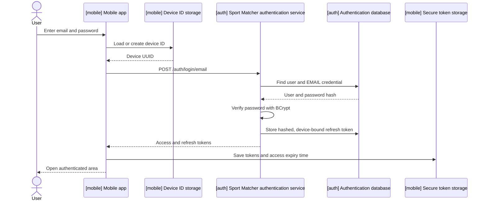

# User login

## Overview

Users sign in with an email and password to receive tokens that give the mobile application access to authenticated features.

## User flow

1. An unauthenticated user sees the welcome screen and selects **Sign in**.
2. The application displays email and password fields.
3. The sign-in button becomes active when:
   - the email has a valid format and is no longer than 254 characters;
   - the password contains between 12 and 255 characters.
4. The application loads an existing device ID or generates and persists a UUID.
5. The application calls `POST /auth/login/email`.
6. The authentication service looks up the user and their email credential, then verifies the password against the stored BCrypt hash.
7. On success, the service creates an access JWT and a refresh token.
8. The application stores the returned tokens in platform secure storage and opens the authenticated user screen.
9. On failure, the user stays on the sign-in screen and sees an error in a red snackbar.

## Interaction



## API contract

### Request

`POST /auth/login/email`

The endpoint is public and expects `Content-Type: application/json`.

```json
{
  "email": "user@example.com",
  "password": "Password1234",
  "deviceId": "550e8400-e29b-41d4-a716-446655440000"
}
```

| Field | Type | Required | Mobile validation | Backend validation | Use |
| --- | --- | --- | --- | --- | --- |
| `email` | string | yes | Valid email, maximum 254 characters | Non-blank, valid email | Finds the user |
| `password` | string | yes | 12–255 characters | Non-blank | Compared with the BCrypt hash |
| `deviceId` | string | yes | Generated UUID | Non-blank | Associated with the refresh token |

### Success response

Status: `200 OK`

```json
{
  "accessToken": "<jwt>",
  "refreshToken": "<opaque-token>",
  "tokenType": "Bearer",
  "expiresIn": 900
}
```

| Field | Description |
| --- | --- |
| `accessToken` | Signed JWT containing the user ID, email, unique token ID, issue time, and expiration time. |
| `refreshToken` | Opaque UUID token used to obtain new tokens. The default lifetime is 604800 seconds (7 days). |
| `tokenType` | Always `Bearer`. |
| `expiresIn` | Access-token lifetime in seconds; the default is 900 seconds. |

### Invalid credentials response

Status: `401 Unauthorized`

```json
{
  "code": "INVALID_LOGIN_CREDENTIALS"
}
```

The same response is returned when:

- the user does not exist;
- the email credential is missing;
- the password hash is missing;
- the password does not match.

The mobile application displays `Invalid login or password.` for this code.

### Other errors

- Request validation failures return `400 Bad Request`.
- HTTP, timeout, connectivity, TLS, parsing, device-ID storage, and token-storage failures are mapped to a user-facing message.
- If login fails, tokens are not saved and the user remains on the sign-in screen.

## Token handling

- After a successful login, the mobile application stores the access token, refresh token, token type, lifetime, and calculated access-token expiry timestamp using `flutter_secure_storage` under the `auth_tokens` key.
- The authentication service stores only the SHA-256 hash of the issued refresh token, together with its user, device ID, expiration time, creation time, and revocation state.

## Security behavior

- Passwords are verified with Spring Security's `BCryptPasswordEncoder` at strength 12.
- Missing accounts and all credential failures share one error code, avoiding a login response that identifies registered email addresses.
- Access tokens are signed with the secret supplied through `JWT_SECRET`.
- Raw refresh tokens are returned only to the client; the database stores their SHA-256 hashes.
- Login, registration, refresh, and logout endpoints are intentionally public in Spring Security. Other endpoints require authentication.
