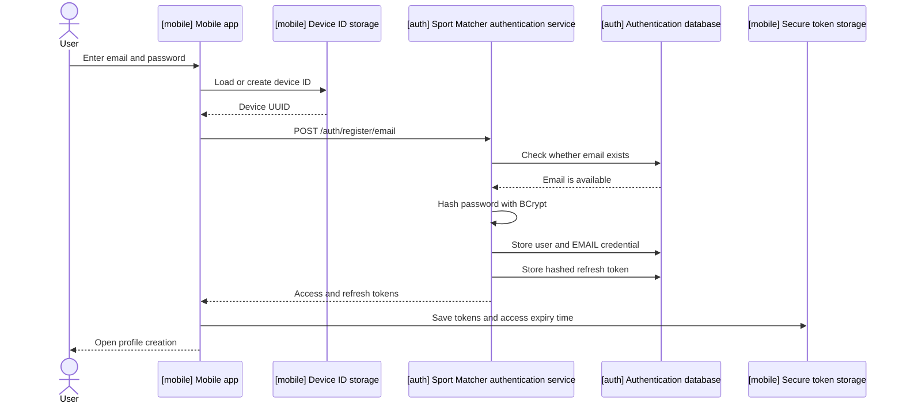

# User registration

## Overview

Users register with an email and password to create an account and continue to profile creation.

## User flow

1. An unauthenticated user sees the welcome screen and selects **Sign up**.
2. The application displays email and password fields.
3. The sign-up button becomes active when:
   - the email has a valid format and is no longer than 254 characters;
   - the password contains between 12 and 255 characters.
4. The application loads an existing device ID or generates and persists a UUID.
5. The application calls `POST /auth/register/email`.
6. The authentication service verifies that the email is not already registered.
7. The service creates the user and stores an email credential with a BCrypt password hash.
8. The service creates an access JWT and a refresh token.
9. The application stores the returned tokens in platform secure storage and opens the profile creation screen.
10. On failure, the user stays on the sign-up screen and sees an error in a red snackbar.

## Interaction



## API contract

### Request

`POST /auth/register/email`

The endpoint is public and expects `Content-Type: application/json`.

```json
{
  "email": "user@example.com",
  "password": "Password1234",
  "deviceId": "550e8400-e29b-41d4-a716-446655440000"
}
```

| Field | Type | Required | Mobile validation | Backend validation | Use |
| --- | --- | --- | --- | --- | --- |
| `email` | string | ✅ | Valid email, maximum 254 characters | Non-blank, valid email | Creates the user and checks for duplicates |
| `password` | string | ✅ | 12–255 characters | Non-blank, minimum 12 characters | Stored as a BCrypt hash |
| `deviceId` | string | ✅ | Generated UUID | Non-blank | Associated with the refresh token |

### Success response

Status: `201 Created`

```json
{
  "accessToken": "<jwt>",
  "refreshToken": "<opaque-token>",
  "tokenType": "Bearer",
  "expiresIn": 900
}
```

| Field | Description |
| --- | --- |
| `accessToken` | Signed JWT containing the user ID, email, unique token ID, issue time, and expiration time. |
| `refreshToken` | Opaque UUID token used to obtain new tokens. The default lifetime is 604800 seconds (7 days). |
| `tokenType` | Always `Bearer`. |
| `expiresIn` | Access-token lifetime in seconds; the default is 900 seconds. |

### Email already registered response

Status: `409 Conflict`

```json
{
  "code": "EMAIL_ALREADY_REGISTERED"
}
```

- No user, credential, or tokens are created.
- The mobile application displays `This email is already in use. Please use a different email.`.

### Validation error response

Status: `400 Bad Request`

```json
{
  "code": "VALIDATION_ERROR"
}
```

This response is returned when:

- The email is blank or invalid.
- The password is blank or shorter than 12 characters.
- The device ID is blank.

### Other errors

- HTTP, timeout, connectivity, TLS, parsing, device-ID storage, and token-storage failures are mapped to a user-facing message.
- If registration fails, tokens are not saved and the user remains on the sign-up screen.

## Token handling

- After successful registration, the mobile application stores the access token, refresh token, token type, lifetime, and calculated access-token expiry timestamp using `flutter_secure_storage` under the `auth_tokens` key.
- The authentication service stores only the SHA-256 hash of the issued refresh token, together with its user, device ID, expiration time, creation time, and revocation state.

## Security behavior

- Passwords are stored using Spring Security's `BCryptPasswordEncoder` at strength 12.
- User, credential, and refresh-token creation run in a single transaction.
- Access tokens are signed with the secret supplied through `JWT_SECRET`.
- Raw refresh tokens are returned only to the client; the database stores their SHA-256 hashes.
- The registration endpoint is intentionally public in Spring Security.
